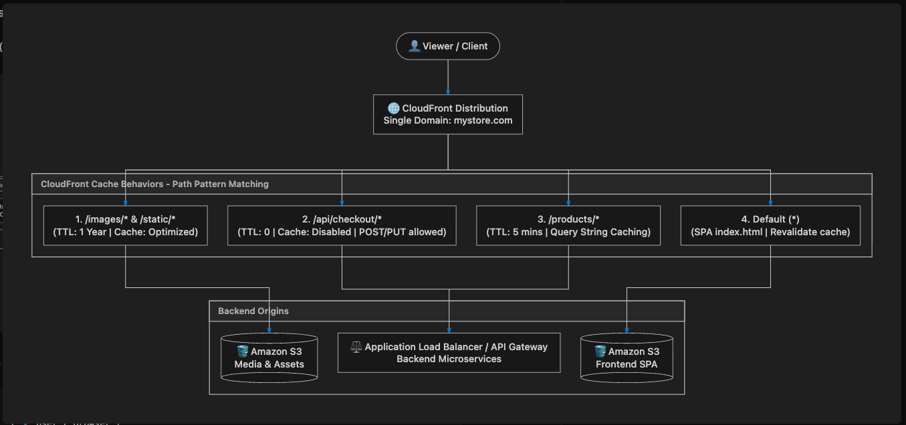
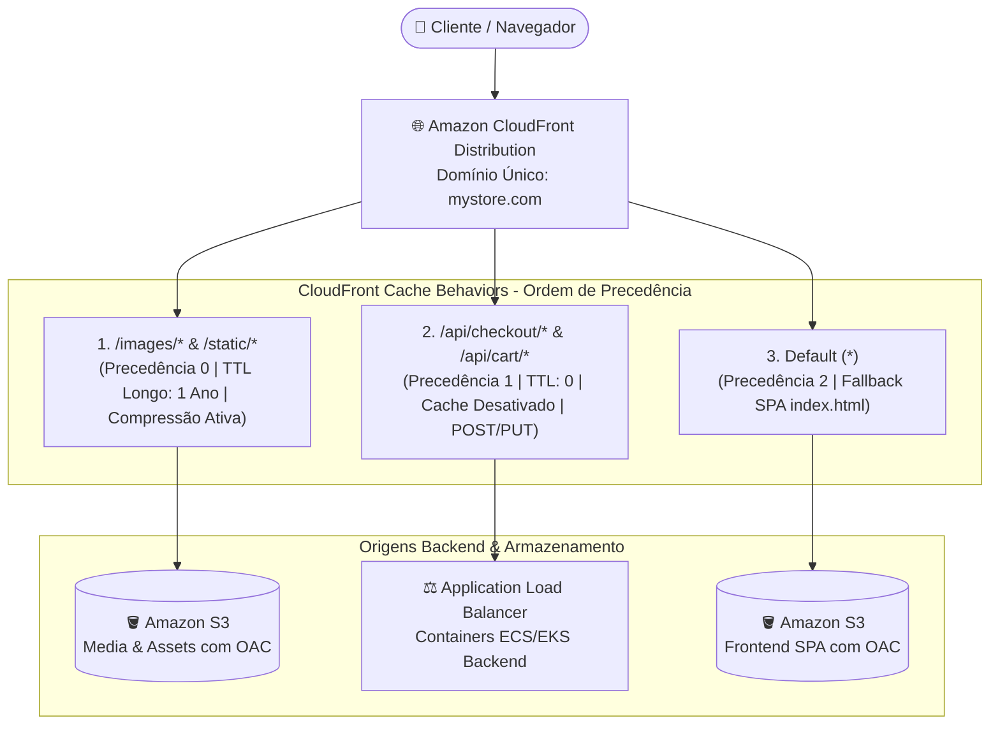

# ⚡ Lab 01: Roteamento Inteligente na Edge com Amazon CloudFront Behaviors

Este lab demonstra como configurar uma distribuição do **Amazon CloudFront** com múltiplos **Cache Behaviors** para rotear tráfego de um e-commerce em um único domínio (`mystore.com`), separando arquivos estáticos (Amazon S3) de APIs dinâmicas e transacionais (Application Load Balancer / Containers).

---

## 🎯 O Problema de Arquitetura

Colocar assets estáticos (imagens de 5MB, banners, fontes, arquivos JavaScript) dentro de imagens Docker e servi-los diretamente pelo container backend traz sérios problemas:
* **Desperdício de Recursos:** Threads e conexões de CPU/RAM caras são gastas apenas lendo arquivos do disco.
* **Imagens Docker Insuportavelmente Grandes (1GB+):** Builds lentos de CI/CD e demora no Auto-Scaling (tempo elevado para puxar a imagem na inicialização de novas réplicas).
* **Ausência de Cache Global na Edge:** Aumenta a latência percebida pelo usuário final.

---

## 🏛️ Diagrama de Arquitetura





---

## 📊 Matriz de Configuração de Behaviors

| Precedência | Path Pattern | Origem Alvo | Política de Cache | Métodos HTTP Permitidos |
| :---: | :--- | :--- | :--- | :--- |
| **0** | `/images/*`, `/static/*` | S3 (Bucket de Assets) | `Managed-CachingOptimized` (TTL: 1 Ano) | `GET, HEAD, OPTIONS` |
| **1** | `/api/*` | ALB (Containers Backend) | `Managed-CachingDisabled` (TTL: 0) + `Managed-AllViewerExceptHostHeader` | `GET, HEAD, OPTIONS, PUT, POST, PATCH, DELETE` |
| **2 (Default)** | `*` | S3 (Bucket Frontend) | `Managed-CachingOptimized` (SPA fallback) | `GET, HEAD` |

---

## 🛠️ Recursos Provisionados via Terraform

* **Amazon S3 Buckets:** 2 buckets privados (Frontend SPA e Assets) com criptografia AES256 e bloqueio total de acesso público (`aws_s3_bucket_public_access_block`).
* **CloudFront Origin Access Control (OAC):** Configuração moderna de segurança recomendada pela AWS para substituir a antiga OAI (*Origin Access Identity*).
* **S3 Bucket Policies:** Políticas que garantem que apenas a distribuição CloudFront via OAC possa ler os objetos.
* **CloudFront Distribution:** Distribuição completa com múltiplos `ordered_cache_behavior` e `custom_error_response` para Single Page Applications (redirecionando erros 403 e 404 para `index.html` com status 200).

---

## 🚀 Como Executar este Lab

### Pré-requisitos
* [Terraform >= 1.5.0](https://www.terraform.io/downloads.html)
* Credenciais da AWS configuradas via AWS CLI (`aws configure`).

### Passo a Passo

```bash
# 1. Copie o arquivo de variáveis de exemplo
cp terraform.tfvars.example terraform.tfvars

# 2. Edite as variáveis conforme seu ambiente (opcional)
vim terraform.tfvars

# 3. Inicialize os providers do Terraform
terraform init

# 4. Valide a sintaxe do código
terraform validate

# 5. Veja o plano de execução
terraform plan

# 6. Aplique a infraestrutura na AWS (se desejar provisionar)
terraform apply
```

---

## 📄 Material Visual (Blueprint & Carrossel)
* **Blueprint da Arquitetura:** [behaviors.png](./behaviors.png)
* **Carrossel LinkedIn (PDF):** [carrossel_cloudfront_behaviors.pdf](./carrossel_cloudfront_behaviors.pdf)
