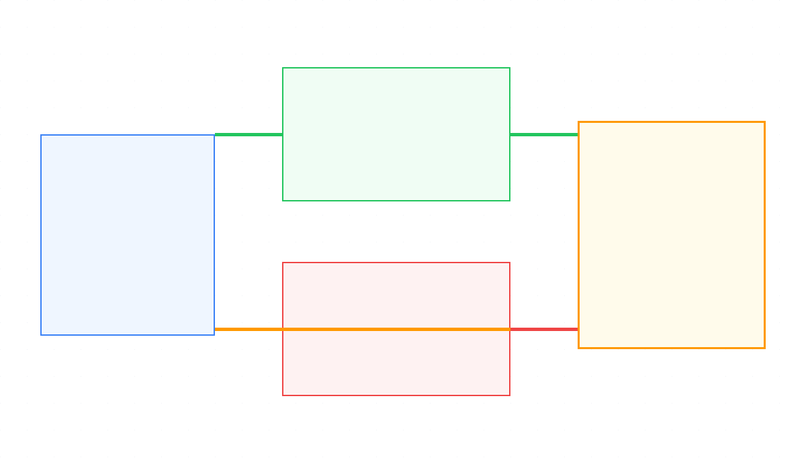
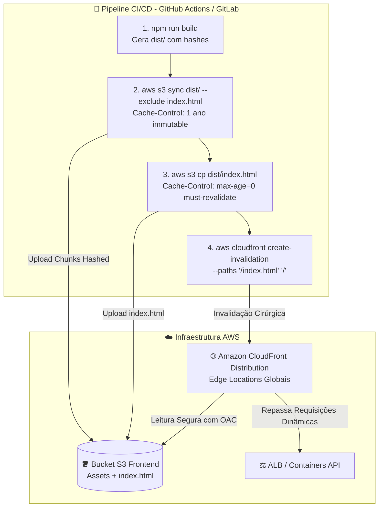

# ⚡ Lab 02: Invalidação de Cache Cirúrgica no Amazon CloudFront & CI/CD

Este lab demonstra como implementar uma estratégia robusta de **Cache-Busting**, cabeçalhos `Cache-Control` granulares e **invalidação cirúrgica** no Amazon CloudFront para uma aplicação de e-commerce moderna (Frontend React SPA + Backend APIs), eliminando telas brancas e desperdício financeiro em pipelines de CI/CD.

---

## 🎯 O Anti-Pattern do `/*` no CI/CD

Executar `aws cloudfront create-invalidation --paths "/*"` a cada deploy em pipelines de CI/CD traz três problemas críticos:
1. **Queda Drástica no Cache Hit Ratio:** Purgar todos os arquivos da borda força a CDN a buscar tudo novamente na origem (S3/EC2/ALB), aumentando a latência global.
2. **Efeito Manada (Thundering Herd):** Durante horários de pico (como Black Friday), uma invalidação ampla pode derrubar os servidores de backend pela avalanche de requisições sem cache.
3. **Custo Desnecessário & Limites:** A AWS disponibiliza **1.000 caminhos de invalidação gratuitos por mês**; após esse limite, cada caminho custa \$0,005. Em ambientes com múltiplos microsserviços e deploys frequentes, esse valor escala rapidamente.
4. **Race Conditions e Telas Brancas (404):** Se o arquivo `index.html` for atualizado antes do término do upload dos novos chunks JavaScript, os usuários recebem erro 404 para os arquivos antigos que foram removidos ou sobrescritos.

---

## 🏛️ Fluxo do Pipeline CI/CD & Arquitetura





---

## 📊 Matriz de Cabeçalhos e Estratégia de Cache

| Tipo de Recurso | Exemplo de Rota | Cabeçalho `Cache-Control` | TTL na Edge | Ação no Deploy (CI/CD) |
| :--- | :--- | :--- | :--- | :--- |
| **Bundles JS/CSS (Hashed)** | `/assets/app.a8f91b.js` | `public, max-age=31536000, immutable` | 1 Ano | **Nenhuma invalidação** (Cache-Busting via nome) |
| **Imagens e Fontes** | `/assets/logo.svg` | `public, max-age=2592000, immutable` | 30 Dias | **Nenhuma invalidação** |
| **Entrypoint SPA** | `/index.html`, `/` | `public, max-age=0, must-revalidate` | 0s / Revalidação | **Invalidação Cirúrgica:** `--paths '/index.html' '/'` |
| **APIs Transacionais** | `/api/cart/*`, `/api/checkout/*` | `no-store, private` | 0s (Cache Desativado) | Nenhuma |
| **APIs de Catálogo** | `/api/catalog/*` | `public, s-maxage=60, stale-while-revalidate=300` | 60s + SWR | Atualização controlada por TTL / Webhook |

---

## 🚀 Exemplo de Workflow CI/CD (GitHub Actions)

Abaixo está o arquivo de pipeline `.github/workflows/deploy.yml` configurado com a ordem correta de sincronização e permissões de menor privilégio:

```yaml
name: Deploy Frontend React to S3 & CloudFront

on:
  push:
    branches: [main]

jobs:
  deploy:
    runs-on: ubuntu-latest
    steps:
      - name: Checkout Code
        uses: actions/checkout@v4

      - name: Setup Node.js & Build
        uses: actions/setup-node@v4
        with:
          node-version: 20
          cache: 'npm'
      - run: npm ci
      - run: npm run build # Gera artefatos em dist/

      - name: Configure AWS Credentials (OIDC)
        uses: aws-actions/configure-aws-credentials@v4
        with:
          role-to-assume: ${{ secrets.AWS_CICD_ROLE_ARN }}
          aws-region: us-east-1

      # 1. Sincroniza chunks versionados PRIMEIRO (com cache agressivo)
      - name: Sync Hashed Assets to S3
        run: |
          aws s3 sync dist/ s3://${{ secrets.S3_BUCKET_NAME }}/ \
            --exclude "index.html" \
            --cache-control "public, max-age=31536000, immutable"

      # 2. Sobe o index.html por ÚLTIMO (com revalidação obrigatória)
      - name: Upload HTML Entrypoint
        run: |
          aws s3 cp dist/index.html s3://${{ secrets.S3_BUCKET_NAME }}/index.html \
            --cache-control "public, max-age=0, must-revalidate"

      # 3. Invalidação cirúrgica de APENAS /index.html
      - name: Surgical CloudFront Invalidation
        run: |
          aws cloudfront create-invalidation \
            --distribution-id ${{ secrets.CLOUDFRONT_DISTRIBUTION_ID }} \
            --paths "/index.html" "/"
```

---

## 🛠️ Recursos Provisionados via Terraform

* **Bucket S3 Privado:** Configurado com bloqueio de acesso público total e criptografia AES256.
* **Origin Access Control (OAC):** Configuração segura que restringe o acesso ao bucket S3 apenas à distribuição CloudFront.
* **Distribuição CloudFront com Múltiplos Behaviors:**
  * Behavior `/assets/*` apontando para o S3 com a política `Managed-CachingOptimized` (Cache de 1 ano para bundles com hash).
  * Behavior `/api/catalog/*` apontando para o ALB com política customizada (`TTL=60s` + cache por Query String + suporte a SWR).
  * Behavior `/api/*` apontando para o ALB com `Managed-CachingDisabled` e repasse total de cookies e tokens de Auth.
  * Default Behavior para roteamento do React SPA e respostas customizadas de erro (403/404 redirecionados para `/index.html`).
* **IAM Role & Policy de Menor Privilégio:** Permissões estritas para o runner do CI/CD fazer upload no S3 e executar `cloudfront:CreateInvalidation` exclusivamente no ARN da distribuição.

---

## 💻 Como Executar este Lab

### Pré-requisitos
* [Terraform >= 1.5.0](https://www.terraform.io/downloads.html)
* Credenciais da AWS configuradas via AWS CLI (`aws configure`).

### Passo a Passo

```bash
# 1. Copie o arquivo de variáveis de exemplo
cp terraform.tfvars.example terraform.tfvars

# 2. Edite as variáveis conforme seu ambiente
vim terraform.tfvars

# 3. Inicialize os providers do Terraform
terraform init

# 4. Valide a sintaxe do código
terraform validate

# 5. Visualize o plano de execução
terraform plan

# 6. Aplique a infraestrutura na AWS
terraform apply
```